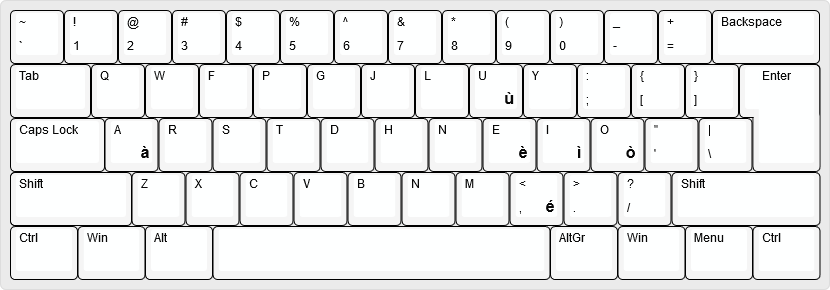

# Variante italiana della tastiera Colemak

Questa variazione del layout originale non fa altro che semplificare leggermente l'inserimento delle vocali accentate della lingua italiana.

La versione originale prevede che `AltGr+vocale` restituisca la vocale con accento acuto.
Ma nella lingua italiana solo una vocale utilizza l'accento acuto mentre tutte le altre usano l'accento grave, per cui ogni volta che bisogna scrivere una delle vocali più usate diventa necessario premere `AltGr+s` per l'accento grave.

## Quindi

Questa tastiera:

* Sostituisce le lettere con accento acuto con quelle con accento grave
  * `AltGr + a` -> `à` 
  * `AltGr + e` -> `è`
  * `AltGr + i` -> `ì`
  * `AltGr + o` -> `ò`
  * `AltGr + u` -> `ù`
* Aggiunge
  * `AltGr + ,` -> `é` (la virgola è il tasto sotto la e)
* Tutto il resto rimane immodificato, identico la layout scaricabile dal [sito ufficiale Colemak](https://colemak.com/)

## Installazione

### Windows

Dato che io stesso non mi fido dei file trovati su internet a muzzo da installare nel sistema, ho messo a disposizione il file sorgente da importare in [Microsoft Keyboard Layout Creator](https://www.microsoft.com/en-us/download/details.aspx?id=102134) e possibilmente modificare a seconda delle proprie preferenze.

Tra le [release](https://github.com/diblui/colemak-it/releases) è presente anche il file d'installazione già esportato con le mie modifiche.

### Android
Si può scegliere se compilare da sé l'apk dal codice sorgente nella sottocartella `android` oppure  

Tra le [release](https://github.com/diblui/colemak-it/releases) si trova l'apk pronto da installare. 
Una volta collegata la tastiera al dispositivo Android, basta andare nella sezione 
> "Lingue" -> "Tastiera" -> "Tastiera fisica"  
Scegliere la tastiera virtuale che si usa normalmente e selezionare il layout  
`Italiano, Stile Colemak Internazionale`

Il percorso non è lo stesso per tutti i dispositivi e cambia da marca a marca, quindi bisogna sforzarsi un attimino di cercare.

### Fine

###### enjoy

